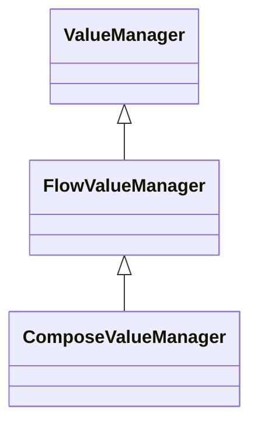

# kotlin-state-manager
A multiplatform and extensible state manager. Its wrapper the managed value to deliver a better, easy and extensible way. It's like a Value class with powerS.

## How it works
There are a lot of ways to use a Value/State Manager

### As a basic variable
```kotlin
class CounterViewModel {
    val counter = basicValueManager(initialValue = 0)
    val counterFlow = flowValueManager(initialValue = 0) // StateFlow version
    val counterCompose = composeValueManager(initialValue = 0)// Jetpack Compose version
    
    var value by basicValueManager(initialValue = 0) // Delegate property version available is all previous version
}
```

### Updating it value
```kotlin
class CounterViewModel {
    fun increment() {
        anyValueManagerType.update(anyValueManagerType.value + 1)
        anyValueManager = anyValueManager + 1 // update method as a Delegate property
        anyValueManager++ // same as previous
    }
}
```

### Listening for changes
```kotlin
class CounterViewModel {
    fun listen() {
        anyValueManagerType.collect {
            // collect without suspend is available in all types
        }
        
        coroutinesScope.launch {
            flowOrComposeValueManagerType.collect {
                // suspend collect avaible in Flow and Compose types
            }
        }
    }
}
```

### Inside Jetpack Compose
```kotlin
@Composable
fun HomeScreen() {
    val counter = remember { 
        composeValueManager(initialValue = 0)
    }
    var counterRemembered by rememberComposeValueManager(initialValue = 0)
    
    val counterState by counter.collectAsState() // ComposeValueManager is a FlowValueManager by default
    
    // Update and listen operations are same
}
```

### Listening for errors
```kotlin
class ErrorHandlerImpl : ErrorHandler {
    override fun onError(exception: Throwable) {
        // error thrown by update operation
    }
}

class CounterViewModel {
    val counter = basicValueManager(
        initialValue = 0,
        errorHandler = ErrorHandlerImpl()
    )
}
```

### Listening lifecycle
```kotlin
class LifecycleHandlerImpl : LifecycleHandler<T> {
    override fun onAfterChange(previous: T, current: T) {
        // ...
    }

    override fun onBeforeChange(current: T, next: T) {
        // ...
    }
}

class CounterViewModel {
    val counter = basicValueManager(
        initialValue = 0,
        lifecycleHandler = LifecycleHandlerImpl()
    )
}
```


### Transforming value before update
```kotlin
class AlwaysEven : TransformHandler<Int> {

    override fun transform(current: Int): Int {
        return current * 2
    }
    
}

class CounterViewModel {
    val counter = basicValueManager(
        initialValue = 0,
        transformHandler = AlwaysEven()
    )
}
```


### Prefer inheritance over composition?
All value manager types has a base class if you need transform your wrapper class in a value manager



#### Any sync context version
```kotlin
class CounterViewModel : BaseValueManager<Int>(initialValue = 0) {
    // Now all operations is available here
}
```

#### A coroutines context version
```kotlin
class CounterViewModel : BaseFlowValueManager<Int>(initialValue = 0) {
    // Now all operations is available here
}
```

#### A compose context version
```kotlin
class CounterViewModel : BaseComposeValueManager<Int>(initialValue = 0) {
    // Now all operations is available here
}
```
