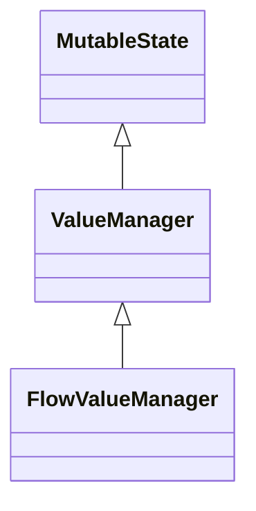

# kotlin-state-manager
A multiplatform and extensible state manager. Its wrapper the managed value to deliver a better, easy and extensible way. It's like a Value class with powerS.

## How it works
There are a lot of ways to use a Value/State Manager

### As a basic variable
```kotlin
class CounterViewModel {
    val counter = basicValueManager(initialValue = 0) // Basic value manager is already compose State
    val counterFlow = flowValueManager(initialValue = 0) // StateFlow version
    
    var value by basicValueManager(initialValue = 0) // Delegate property version available by compose getValue and setValue
}
```

### Updating it value
```kotlin
class CounterViewModel {
    fun increment() {
        anyValueManagerType.update { current -> current + 1 }
        anyValueManager = anyValueManager + 1 // update method as a Delegate property
        anyValueManager++ // same as previous
    }
}
```

### Collecting value changes
```kotlin
class CounterViewModel {
    fun listen() {
        anyValueManagerType.collect {
            // collect without suspend is available in all types
        }
        
        coroutinesScope.launch {
            flowValueManagerType.collect {
                // suspend collect available in Flow
            }
        }
    }
}
```

### Inside Jetpack Compose
```kotlin
@Composable
fun HomeScreen() {
    val counter = basicValueManager(initialValue = 0)
    var counterRemembered by rememberBasicValueManager(initialValue = 0)
    
    val counterState by counter.collectAsState() // Available when using FlowValueManager
    
    // Update and listen operations are same
}
```

### Listening for errors
```kotlin
class ErrorHandlerImpl : ErrorHandler {
    override fun onError(exception: Throwable) {
        // error thrown by update operation
    }
}

class CounterViewModel {
    val counter = basicValueManager(
        initialValue = 0,
        errorHandler = ErrorHandlerImpl()
    )
}
```

### Listening for changes
```kotlin
class ChangeHandlerImpl : ChangeHandler<T> {
    override fun onChanged(previous: T, next: T) {
        // ...
    }
}

class CounterViewModel {
    val counter = basicValueManager(
        initialValue = 0,
        changeHandler = ChangeHandlerImpl()
    )
}
```

### Validations are supported
```kotlin
class PositiveValidator(
    override val message: (Int) -> String = { "Value $it should be positive" }
) : Validator<Int> {
    override fun isValid(value: Int): Boolean = value > 0
}

val counter = basicValueManager(initialValue = 0)

counter.addValidator(PositiveValidator())
// or
counter += PositiveValidator()

// Put a value don't trigger validations
counter.value = -1
// Call validate() to trigger validations
counter.validate()

// Calling update always trigger validations and don't need call validate()
counter.update { -1 }

// Checking is valid
counter.isValid()

// Getting validators messages
counter.messages()
```

### Prefer inheritance over composition?
All value manager types has a base class if you need transform your wrapper class in a value manager



#### Any sync context version
```kotlin
class CounterViewModel : BaseValueManager<Int>(initialValue = 0) {
    // Now all operations is available here
}
```

#### A coroutines context version
```kotlin
class CounterViewModel : BaseFlowValueManager<Int>(initialValue = 0) {
    // Now all operations is available here
}
```

